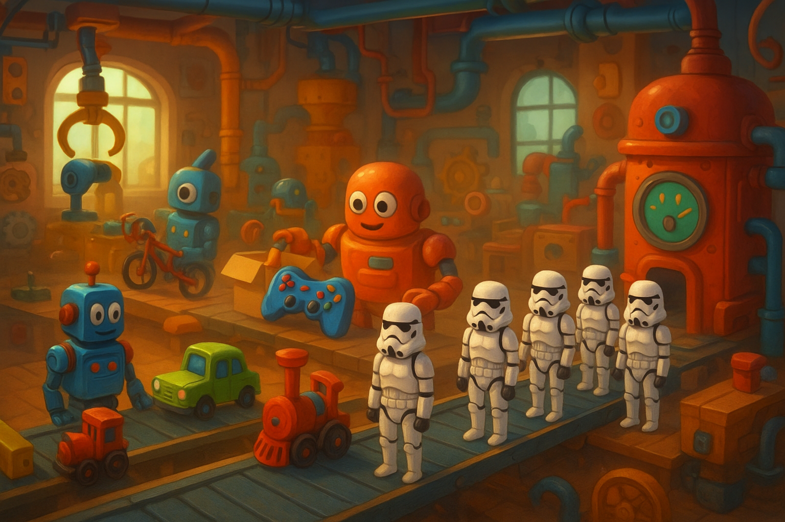

# Aeron Toys

An event-driven toy manufacturing system using Aeron Cluster for distributed state management.



## Overview

This project recreates a toy manufacturing workflow using Aeron Cluster for fault-tolerant state management. It follows a physical/logical service architecture:

**Physical Services:**
- **toyfactory**: Clustered service hosting logical toy factories
- **toyworld**: Standalone service providing world/supplier operations

**Logical Services:**
- **ToyFactoryService**: Manages toy creation state machine within the cluster
- **CustomerService, SupplierService, WorkerService**: Separate service classes within ToyWorld

## Architecture

The system follows a **physical/logical service pattern**:

- **Physical Services**: Deployment units (binaries) that provide infrastructure
- **Logical Services**: Business logic components hosted within physical services

### Physical vs Logical Services

**Physical Services** (Infrastructure):
- `ClusterNode`: Boots Aeron Cluster and registers logical services
- `ToyWorldService`: Runs standalone worker coordination

**Logical Services** (Business Logic):
- `ToyFactoryService`: Toy state machine (SERVICE_ID: 100)
- Future: `BicycleFactoryService`, `StormtrooperFactoryService`, etc.

### State Machine

Toys progress through the following states:
1. **Pending** → **Sourced**: Raw materials acquisition
2. **Sourced** → **Assembled**: Toy assembly process
3. **Assembled** → **Completed**: Final packaging and completion

This separation allows different toy factories to be added as logical services to the same cluster infrastructure.

## Prerequisites

- Java 17 or later
- Gradle 8.5+ (or use included wrapper)
- Make (for build convenience)

## Building

```bash
# Build all modules
./gradlew build

# Package JAR files
./gradlew jar

# Run tests
./gradlew test

# Clean build
./gradlew clean
```

## Running

### Option 1: Using Make (Recommended)

In separate terminals:

```bash
# Terminal 1 - Start ToyFactory
make run-toyfactory

# Terminal 2 - Start ToyWorld
make run-toyworld
```

### Option 2: Using Maven directly

```bash
# Terminal 1 - ToyFactory Cluster
./gradlew :toyfactory:run --args="0"

# Terminal 2 - ToyWorld Service
./gradlew :toyworld:run
```

### Option 3: Using JAR files

```bash
# Build JARs first
./gradlew jar

# Run services
java -jar toyfactory/build/libs/toyfactory.jar 0
java -jar toyworld/build/libs/toyworld.jar
```

## Project Structure

```
aeron-toys/
├── shared/           # Common types and utilities
│   └── src/main/java/io/github/andrewwormald/aerontoys/shared/
│       ├── Toy.java         # Toy entity
│       └── ToyStatus.java   # Status enumeration
├── toyfactory/       # Physical: Aeron Cluster service
│   └── src/main/java/io/github/andrewwormald/aerontoys/toyfactory/
│       ├── ClusterNode.java         # Physical cluster infrastructure
│       └── ToyFactoryService.java   # Logical service (SERVICE_ID: 100)
├── toyworld/         # Physical: Standalone service
│   └── src/main/java/io/github/andrewwormald/aerontoys/toyworld/
│       ├── ToyWorldService.java     # Main service coordinator
│       ├── customer/CustomerService.java
│       ├── supplier/SupplierService.java
│       └── workers/WorkerService.java
├── Makefile          # Build automation
├── build.gradle     # Root Gradle build script
├── settings.gradle  # Gradle settings
└── gradlew         # Gradle wrapper
```

## State Machine

Toys progress through the following states:

- **UNKNOWN**: Invalid state
- **PENDING**: Newly created toy awaiting processing
- **SOURCED**: Materials have been sourced from suppliers
- **ASSEMBLED**: Toy has been assembled by workers
- **COMPLETED**: Toy is finished and ready for delivery

## Services

### ToyFactory Service

The ToyFactory runs as an Aeron Cluster service providing:

- **Fault tolerance**: State is replicated across cluster nodes
- **Consistency**: All state changes go through Raft consensus
- **Event sourcing**: All state transitions are logged as events
- **State machine**: Handles toy lifecycle transitions

### ToyWorld Service

The ToyWorld service provides supporting infrastructure:

- **Customer Service**: Handles customer interactions and orders
- **Supplier Service**: Manages material sourcing and supplier communications
- **Worker Service**: Coordinates assembly line workers

## Configuration

The services use the following default ports:

- **Aeron Cluster**: 20110, 20220, 20330, 8010
- **ToyWorld Communication**: 40123

Logs are written to the `logs/` directory with daily rotation.

## Development

For development, use the dev targets for automatic recompilation:

```bash
# Development mode (continuous build)
./gradlew :toyfactory:run --args="0" --continuous
./gradlew :toyworld:run --continuous
```

## Cluster Operation

The ClusterNode can run in cluster mode for high availability. To start a 3-node cluster:

```bash
# Node 0
./gradlew :toyfactory:run --args="0"

# Node 1 (in separate terminal)
./gradlew :toyfactory:run --args="1"

# Node 2 (in separate terminal)
./gradlew :toyfactory:run --args="2"
```

Each physical ClusterNode hosts all registered logical services (ToyFactoryService, etc.).

## API

### ToyFactoryService (SERVICE_ID: 100)

The ToyFactoryService logical service accepts simple text messages:

**Commands:**
- `CREATE_TOY:<customerId>` - Create a new toy for customer
- `UPDATE_TOY:<toyId>:<newStatus>` - Update toy status
- `GET_TOY:<toyId>` - Retrieve toy information

**Responses:**
- `TOY_CREATED:<toyId>:<customerId>:<status>`
- `TOY_UPDATED:<toyId>:<status>`
- `TOY_INFO:<toyId>:<customerId>:<status>`
- `TOY_NOT_FOUND:<toyId>`

### Future Logical Services

Additional toy factories can be added following the same pattern:
- `BicycleFactoryService` (SERVICE_ID: 101)
- `StormtrooperFactoryService` (SERVICE_ID: 102)